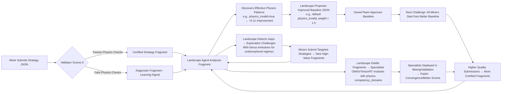

# Hydrogen Subnet: Building the Representation Layer for Physical Intelligence  
*A Decentralized Marketplace for Verified Physics Intelligence on Bittensor*  

---

## The Thesis: Why Physics Needs a Representation Layer  

> *"Every durable market begins with a better model of the world."*  
> — Meltem Demirors, Crucible Capital  

Today, engineering simulation is broken:  
- **Slow**: A single high-fidelity CFD/FEA simulation takes hours or days.  
- **Expensive**: Requires specialized HPC clusters and expert operators.  
- **Untrustworthy**: Surrogates often fit training data but violate physics (e.g., creating energy from nowhere), leading to costly field failures.  
- **Siloed**: Knowledge doesn’t transfer between problems, teams, or industries.  

Yet the demand for faster, more reliable simulation is exploding:  
- Digital twins for manufacturing, energy grids, and infrastructure  
- Real-time optimization of power grids and supply chains  
- Accelerated R&D in aerospace, automotive, and pharmaceuticals  
- Uncertainty quantification for climate modeling and risk assessment  

**The core insight**: Just as high-frequency trading firms built proprietary representations of market microstructure to gain structural advantages, we can build a **decentralized representation layer for the physical world**—where every verified improvement in physics simulation becomes a tradable commodity that compounds into lasting engineering value.  

This is Hydrogen: a Bittensor subnet that turns the "sim-to-real gap" from a frustrating limitation into a self-improving market for physical intelligence.  

---

## How Hydrogen Works: The Knowledge Flywheel  

Hydrogen operates as a self-improving system where three specialized layers create compounding value:  

### 1. The Miner: Innovating on Training Strategy (Zero Compute Burden)  
Miners **do not upload models or code**. Instead, they submit lightweight **training strategy JSONs** (≈1KB) describing *how* to train a surrogate:  
```jsonc  
{  
  "backbone": "FNO",  
  "resolution": [128, 128],  
  "fno": { "fourier_modes": [16, 16] },  
  "pino": { "pino_loss_weight": 1.8 },  
  "physics_informed": true,  
  "curriculum_learning": { "enabled": true }  
}  
```  
- **Why this works**: Miners innovate on *what matters most* for physics fidelity (e.g., increasing Fourier modes to capture turbulence spectra, weighting physics loss to enforce conservation laws).  
- **Burden near-zero**: Editable on a laptop; no training, no model uploads, no heavy dependencies.  
- **Fee**: 0.1 TAO submission (covers validator cost; prevents spam).  

### 2. The Validator: Trustworthy, Physics-Aware Scoring  
Validators execute **deterministic, physics-validated scoring** using pre-built backend images:  
1. Pull a pinned Docker image (FNO, PINO, DeepONet, etc., with PhysicsNeMo + NeuralOperator).  
2. Train the surrogate using the miner’s strategy on public benchmark data.  
3. **Score improvement** vs. the current baseline on a public hold-out set.  
4. **Run a hidden stress test** (algorithmically varied per challenge ID) that includes **hard physics checks**:  
   - ❌ *Hard rejection* if mass conservation error > 1e-3 (`‖∇·u‖₁`)  
   - ❌ *Hard rejection* if energy dissipation rate > 1e-4 (`dE/dt > 0` should be ≤0 for dissipative systems)  
   - ⚠️ *Soft penalty* if symmetry error > 0.05 (`‖u - u_flipped‖₂ / ‖u‖₂`)  
5. **Final score** = `[max(0, improvement)] × 1.20` **only if all hard checks pass** (else score = 0).  
- **Why this works**:  
  - Scores reflect **verified physical improvement**—not just curve fitting.  
  - Hidden stress test prevents overfitting; hard physics checks eliminate physically nonsensical surrogates.  
  - Validator work is predictable and parallelizable (~5-10 min/submission on RTX 3060).  

### 3. The Landscape: Compounding Intelligence (Agent/Team Managed)  
All miner submissions (winning and losing) feed a shared **knowledge landscape** that distills strategies into better baselines, reusable specialists, and eventually a foundation neural operator:  



**Key knowledge outputs**:  
- **Improved Baseline JSON**: Updated post-challenge (e.g., raise default `fourier_modes` to `[16,16]`, set `physics_invalid=true`).  
- **Specialist Bank**: ONNX/TensorRT modules distilled from winning strategies, tagged with:  
  - `competency_domains` (e.g., `["navier_stokes/re>5000", "mass_conservation: true"]`)  
  - `known_failure_modes` (e.g., `["mass_nonconservation"]` from fragment evidence)  
  - `reuse_count` (real-world utility → drives retroactive rewards)  
- **Exploration Challenges**: Landscape agent identifies underexposed physics regimes (e.g., high-Reynolds NS) and triggers bonus-emission challenges.  

---

## Why This Works: Aligned Incentives & Physics Rigor  

### ✅ For Miners Win-Win Incentive Structure  
| Actor | Incentive | How It’s Paid |  
|-------|-----------|---------------|  
| **Miner** | Earn emissions for **verified physical improvement** | Rank-based payout (40%/30%/20%/10% of miner emissions) based on final score |  
| **Landscape Agent** | Funded by team | Pays for analysis, baseline updates, specialist distillation |  
| **Validator** | Covered by **0.1 TAO submission fee** | Cost ≈ 0.04–0.07 TAO/submission (well under fee) |  
| **Owner/Team** | **18% of emissions** + **IP licensing revenue** | Funds BD, legal, and strategic growth |  

### ✅ Anti-Gaming & Physics Trust  
- **No model uploads**: Eliminates weight fabrication and overfitting to public benchmarks.  
- **Hard physics gates**: Score = 0 if mass/energy conservation fails—*no credit for physically invalid surrogates*.  
- **Knowledge compounding**: Landscape learns *which strategies improve physical fidelity* (e.g., `"pino_loss_weight=1.8 → mass conservation error ↓ 75%"`), not just statistical correlations.  
- **Custom data incentives**: Miners paid only for data that *reduces physics error* (measured via impact on winning strategies).  

### ✅ Buildability & Scalability  
- **Phase 0 launchable in <4 weeks**:  
  - Uses existing PhysicsNeMo/NeuralOperator tooling (no new ML research needed).  
  - Validator images: 5 pinned Docker images (FNO, PINO, DeepONet, GNO, OFormer).  
  - Miner workload: Editing a JSON file (laptop/phone capable).  
  - Validator workload: ~5-10 min/submission on RTX 3060 (parallelizable).  
- **Physics-first design**:  
  - Benchmarks target foundational physics domains (Poisson, Darcy, NS vorticity, elasticity).  
  - Stress tests probe *physical* failure modes (mass conservation, energy dissipation, symmetry).  
  - Landscape agent learns physics-relevant levers (e.g., `"Raise pino_loss_weight to fix mass conservation in Darcy"`).  

---

## Roadmap: From Strategy Submission to Foundation Model  

### Phase 0: Foundation (Weeks 1-6)  
**Goal**: Prove the knowledge flywheel works on foundational physics.  
- **Challenges**: 2D Poisson, 2D Darcy flow, 2D NS vorticity, 2D linear elasticity (all from PhysicsNeMo/NeuralOperator).  
- **Miner innovation**: Strategy JSON only (backbone choice, loss weights, optimizer, scheduler, physics flags, curriculum).  
- **Landscape agent**:  
  - Stores all strategy fragments in SQLite.  
  - Weekly correlation job: Discovers physics-relevant patterns (e.g., `pino_loss_weight=1.8 → mass conservation error ↓ 75% in Darcy`).  
  - Proposes baseline JSON updates (e.g., raise default `pino_loss_weight`).  
- **Success metric**: Median miner improvement score > 0.05 vs. genesis baseline after 20 challenges.  
- **Outcome**: A self-improving baseline where miners start from better starting points each cycle.  

### Phase 1: Adapter Innovations & Custom Data (Weeks 7-16)  
**Goal**: Let miners express finer improvements; reward high-quality data.  
- **New miner affordances**:  
  - **Adapter block** (≈1KB): e.g., LoRA rank=4 on `fno_layers.0.spectral_conv` to tweak a winning backbone without full retraining.  
  - **Enhanced custom data**: Miners submit high-fidelity simulations/curricula; paid via data-royalty pool (5% of emissions) for *measured impact* on physics error.  
- **Landscape agent**:  
  - Tracks adapter/custom data impact on physics errors (e.g., `"LoRA rank=4 → energy dissipation ↓ 0.0002"`).  
  - Proposes baseline updates (e.g., enable curriculum by default for transient problems).  
- **Success metric**: Median improvement score increases ≥0.03 vs. Phase 0 baseline after 4 weeks.  

### Phase 2: Specialist Marketplace (Weeks 17-28)  
**Goal**: Turn winning strategies into ready-to-use, reusable surrogates.  
- **New miner affordances**:  
  - **Specialist selection**: Submit `{"specialist_id": "pino_darcy_v3", "adapter": {...}}` to pick/refine an existing specialist.  
  - **Specialist bank**: Pre-built ONNX/TensorRT specialists (e.g., a Darcy specialist that conserves mass) stored in the landscape.  
  - Validator load: Near-zero for selection (load specialist → run inference); low for improvement (train adapter weights only).  
- **Landscape agent**:  
  - Distills top strategies into specialists (validated against physics checks).  
  - Runs multi-teacher distillation across the specialist bank to produce a **foundation neural operator**.  
- **Success metric**: Specialist bank contains ≥20–30 high-quality specialists; foundation operator outperforms best individual specialist on mixed validation set.  

### Phase 3+: Foundation Model & Agent-Driven Discovery (Month 7+)  
**Goal**: Provide a general-purpose physics-informed neural operator for fine-tuning; let SAGE agent drive discovery.  
- **New miner affordances**:  
  - **Foundation model fine-tuner**: Submit minimal strategy JSON + custom data blob; validator fine-tunes foundation model for few epochs.  
  - **SAGE-agent collaborator**: Propose new architectures/loss terms (e.g., `"Adding deformable Fourier-mode block improves 3D NS turbulence spectra"`).  
- **Landscape agent (SAGE-Style)**:  
  - Runs lightweight experiments to test hypotheses.  
  - Issues custom-data bounties (e.g., `"Collect high-Reynolds NS snapshots in Re=500–2000"`).  
  - Updates foundation model based on validated hypotheses.  
- **Success metric**: Sustainable revenue from foundation model licensing/API usage covers >50% of miner rewards.  

---

## Investment thesis: Why Hydrogen Creates Real Engineering Value  

### The Core Value Proposition  
Hydrogen doesn’t just create another crypto token—it builds **actionable physics intelligence** that directly reduces the cost of innovation in engineering:  

| Engineering Pain Point | How Hydrogen Solves It | Economic Impact |  
|------------------------|------------------------|-----------------|  
| **Slow simulations** (hours/days per run) | Surrogates run in **milliseconds** on edge/cloud | 100–1000× faster design iterations → faster time-to-market |  
| **Untrustworthy surrogates** (fit data but violate physics) | **Physics-validated surrogates** (hard conservation/energy checks in validator) | Eliminates costly field failures (e.g., buckling bridges, thermal runaway in batteries) |  
| **Siloed knowledge** (no transfer between problems/teams) | **Knowledge landscape compounds improvements** → better baselines/specialists for all | Reduces R&D duplication; accelerates cross-domain innovation |  
| **Expensive HPC reliance** | Surrogates run on **edge devices** (jets, factories, medical implants) | Enables real-time control and decentralized monitoring |  

### The Path to Sustainable Revenue  
While emission rewards drive early miner participation, long-term value comes from:  
1. **Specialist Marketplace (Phase 2+)**:  
   - Sell ONNX/TensorRT specialists under AGPL-3.0 (open) or commercial licenses (e.g., a "Darcy high-contrast permeability specialist" for reservoir engineers).  
   - *Revenue model*: Per-download, per-API-call, or support subscriptions.  
2. **Foundation Model Licensing (Phase 3+)**:  
   - Offer the physics-foundation neural operator as a service:  
     - **API access**: Pay-per-query for fine-tuned surrogates (e.g., `"What is the stress concentration for this notch geometry?"`).  
     - **Model downloads**: Commercial licenses for on-premise deployment (e.g., in digital twin platforms).  
   - *Revenue model*: Subscription tiers (free tier for academics; paid for enterprise SLAs).  
3. **Data-Royalty Pool (Ongoing)**:  
   - Miners paid for high-impact custom data (e.g., a high-Reynolds NS DNS dataset) proportional to its measured error reduction.  
   - *Revenue model*: 5% of emissions allocated to data royalties—funded by the subnet’s emission rewards.  

### Why This Beats Alternatives  
| Approach | Fatal Flaw | How Hydrogen Avoids It |  
|----------|------------|------------------------|  
| **Pure compute marketplace** (e.g., rent FLOPs) | Rewards quantity, not quality; no knowledge compounding | Rewards *verified physics improvement*; knowledge compounds in landscape |  
| **Model-upload subnet** (e.g., miners submit surrogates) | Validator can’t verify physics at scale; overfitting/rampant fraud | Strategy-only submission + hard physics checks = provable physical improvement |  
| **Generic AI subnet** (e.g., text/image generation) | No tie to physical value; engineering users won’t adopt | Every innovation targets a *specific, verifiable physics problem* with engineering relevance |  
| **Closed-door research consortium** | Slow, inaccessible, no economic incentives for global talent | Open, permissionless, and pays miners in TAO for real progress |  

---

## Go-to-Market Strategy: From Subnet to Engineering Workflow  

### Phase 0–1: Build Miner & Validator Base  
- **Target miners**: Physics-informed ML researchers, HPC enthusiasts, academic labs (low barrier: edit JSON on laptop).  
- **Target validators**: Universities, research labs, or professional node operators with RTX 3060+ GPUs.  
- **Tactics**:  
  - Partner with PhysicsNeMo/NeuralOperator communities for early miner adoption.  
  - Provide pre-built validator images and miner CLI (one-click setup).  
  - Launch with 2D Poisson challenge—quick to run, high signal-to-noise for early adoption.  

### Phase 2: Specialist Marketplace Launch  
- **Target users**: Engineering teams needing fast, trustworthy surrogates for specific problems (e.g., aerospace stress analysis, reservoir modeling).  
- **Tactics**:  
  - List specialists on a public marketplace (e.g., `hydrogen/pino_darcy_v3.onnx` with AGPL-3.0 license).  
  - Integrate with popular tools:  
    - **ANSYS/Fluent**: Add a "Hydrogen Specialist" button to load a pre-built surrogate.  
    - **Simulink**: Create a block that calls the specialist API for real-time control.  
    - **Python/scikit-learn**: Wrap specialists as sklearn-compatible estimators.  
  - *Value prop*: "Get a physics-validated surrogate for your Darcy flow problem in 5 minutes—no training, no HPC, no PhD required."  

### Phase 3+: Foundation Model & Enterprise Sales  
- **Target users**: Enterprises needing scalable, customizable physics simulation (OEMs, energy companies, medtech).  
- **Tactics**:  
  - Offer the foundation model as:  
    - A **cloud API** (pay-per-surrogate-query) for occasional use.  
    - An **on-premise license** (annual fee) for high-volume use (e.g., in digital twin platforms).  
  - Partner with system integrators (e.g., Siemens, Dassault Systèmes) to embed Hydrogen surrogates in their simulation suites.  
  - *Value prop*: "Replace your slow FEA solver with a Hydrogen-surrogate-accelerated workflow—get 100× more design iterations in the same time."  

### Early Adopter Incentives  
- **Academics**: Free access to foundation model for research; co-author opportunities on knowledge compounding papers.  
- **Early validators**: Bonus emissions for helping bootstrap the network (first 50 validators get 2× emissions for 3 months).  
- **Pioneer miners**: NFTs for first 100 strategy submissions that improve baselines by >5% (redeemable for specialist marketplace access).  

---

## Downstream Implications of Success  

If Hydrogen achieves its vision, the ripple effects transform how we engineer the physical world:  

### 1. **Democratizing Physics Simulation**  
- A student in Nairobi can run a turbine blade stress analysis on their laptop using a Hydrogen specialist—no $50k/workstation or ANSYS license needed.  
- A startup in Jakarta can optimize battery thermal management using a foundation model fine-tuned on their specific cell chemistry—no HPC cluster required.  

### 2. **Accelerating Innovation Cycles**  
- **Automotive**: Reduce CFD iterations for aerodynamics from weeks to hours → faster EV development.  
- **MedTech**: Test 100× more stent designs in silico → fewer animal trials, faster FDA approval.  
- **Energy**: Simulate 10,000+ CO₂ sequestration scenarios in a day → optimal site selection in weeks, not years.  

### 3. **New Business Models Emerge**  
- **Simulation-as-a-Service (SaaS)**: Platforms like AWS/Azure offer "Hydrogen-accelerated physics" as a premium compute tier.  
- **Insurance**: Dynamic premiums based on real-time structural health monitors powered by Hydrogen surrogates (e.g., bridge fatigue prediction).  
- **Materials Science**: Reverse-engineer novel alloys by querying the foundation model: *"What microstructure yields this target strength/conductivity?"*  

### 4. **The Ultimate Impact: A Physical World Representation Layer**  
Just as the IP protocol enabled the internet, Hydrogen enables:  
- **Trustworthy digital twins**: Simulations that engineers can bet lives and capital on.  
- **Physics-aware AI**: Foundation models that understand governing equations—not just patterns.  
- **Global collaboration**: A surgeon in Boston and a farmer in Nairobi using the same surrogate to optimize a medical implant or irrigation system—knowing it respects the same physics.  

> **This is not just a subnet. It’s the first step toward a world where simulating the physical world is as cheap, fast, and reliable as simulating the digital world—and where every engineer, regardless of location or resources, can innovate at the speed of thought.**  
